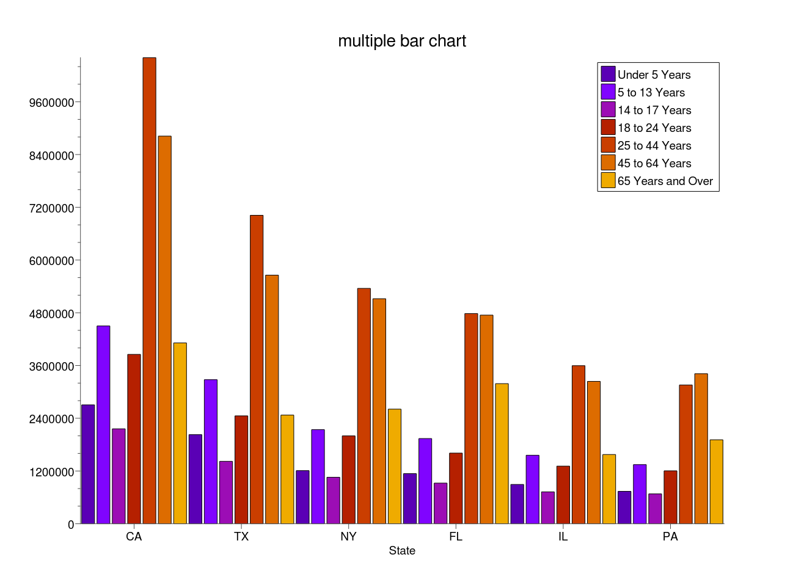
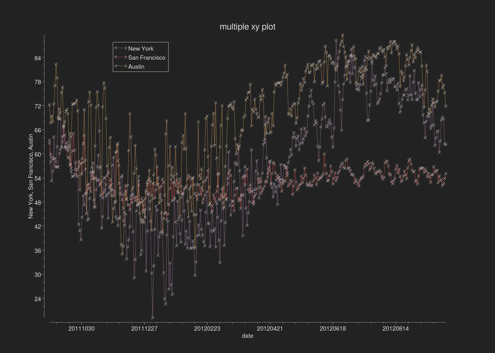

# CQCharts

Qt charting library to support displaying a interactive chart from an
QAbstractItemModel with support for cross selection using a
QItemSelectionModel.

Charts are live in that changes to the data model automatically update
the chart which allows the programmer to build interactive charts
where user can select items from the model using a table/tree view and/or
the display chart data.

Chart types supported 
  + Adjacency
    + tabular connectivity table (needs special column value syntax for connections)
  + BarChart
    + 1d bar chart for column value
    
  + Box
    + Box plot of agregated values from value and group columns
  + Bubble
    + Bubble plot where circle is size of column value
  + Chord
    + Circlualar connectivity chart (needs special column value syntax for connections)
  + Delaunay
    + Delaunay/Voronoi geometric connectivity chart
  + Distribution
    + Distribution count of range based values
  +  ForceDirected
    + Force directed connectivity chart
  + Geometry
    + General polygon geometry colored by value
  + HierBubble
    + Hierarchical bubble plot where circle is size of column value
  + Image
    + Image plot (x, y, color)
  + Parallel
    + Parallel lines plots multiple overlaid value sets
  + Pie
    + Pie chart
  + Radar
    + Radar (polygon pie chart)
  + Scatter
    + Scatter plot of disparate values
  +  Sunburst
    + Hierarchical pie chart plot
  + TreeMap
    + Hierarchical tree map
  + XY
    + x/y monotic value plot
    
